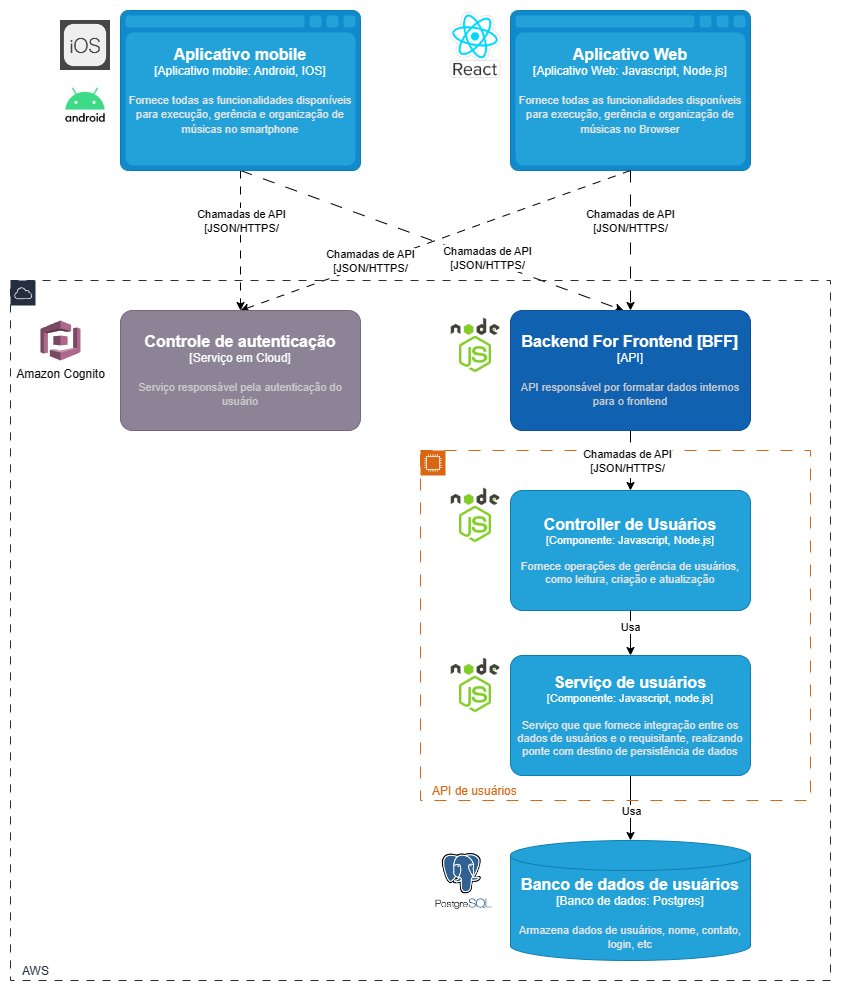

# SpotMusic - Serviço de Gerenciamento de Usuários

## Visão Geral
Este repositório contém o serviço de gerenciamento de usuários da SpotMusic, que é responsável por operações relacionadas à gestão de contas de usuários, incluindo criação, autenticação, autorização e gerenciamento de perfis de usuário.

## Funcionalidades
- Criação e manutenção de contas de usuário.
- Autenticação de usuários e gerenciamento de sessões.
- Autorização e controle de acesso.
- Integração com sistemas de terceiros para login social.
- Recuperação de senha e segurança de contas.

## Arquitetura do serviço de gestão de usuários

Este serviço faz parte de uma arquitetura de microserviços e é construído com base em APIs RESTful. Ele é projetado para ser seguro, confiável e facilmente escalável.



## Pilha Tecnológica
- **Linguagem de Programação:** NodeJS
- **Banco de Dados:** PostgreSQL no Amazon RDS
- **Fila de Mensagens:** Amazon SQS
- **Monitoramento:** Zabbix

## Configuração e Instalação
Para configurar e executar o `spotmusic-user-service` localmente, siga os passos abaixo:

```bash
# Clone o repositório
git clone https://github.com/fiap-spotmusic/spotmusic-user-service.git
cd spotmusic-user-service

# Instale as dependências
pip install -r requirements.txt

# Copie o arquivo .env.template, cole como .env e substitua as variáveis apontando para o ambiente desejado

# Carregue as variáveis de ambiente
export $(cat .env | xargs)

# Execute as migrações para o banco de dados
flask db upgrade

# Inicie o serviço
flask run
